# McCain Capital

<p align="center">
  
</p>

<p align="center">
  <b>Private Trading Workspace</b><br/>
  A personal trading operating system for execution, review, discipline, and growth.
</p>

<p align="center">
  
  
  
</p>

---

## Product Overview

McCain Capital is a purpose-built platform for a discretionary trader to run the full daily loop:
plan risk, execute trades, journal decisions, review behavior, and monitor consistency.

## Core Capabilities

- Dashboard control center with live today/MTD/YTD visibility
- Trade logging, statement upload, paste import, and reconciliation
- Journal with linked-trade workflow and weekly review
- Analytics by setup/session/hour with expectancy and drawdown diagnostics
- Calculator for pre-trade risk/reward planning
- Goals and payouts module for consistency and withdrawal readiness
- Guardrails + auth for disciplined operational flow
- Branded premium UI with custom McCain iconography and showcase panels

---

## Featured Screenshots

### Desktop Showcase

#### Dashboard
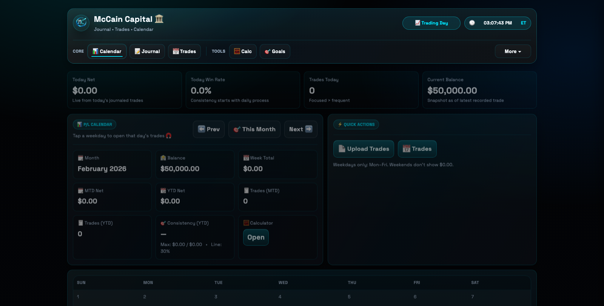

#### Trades
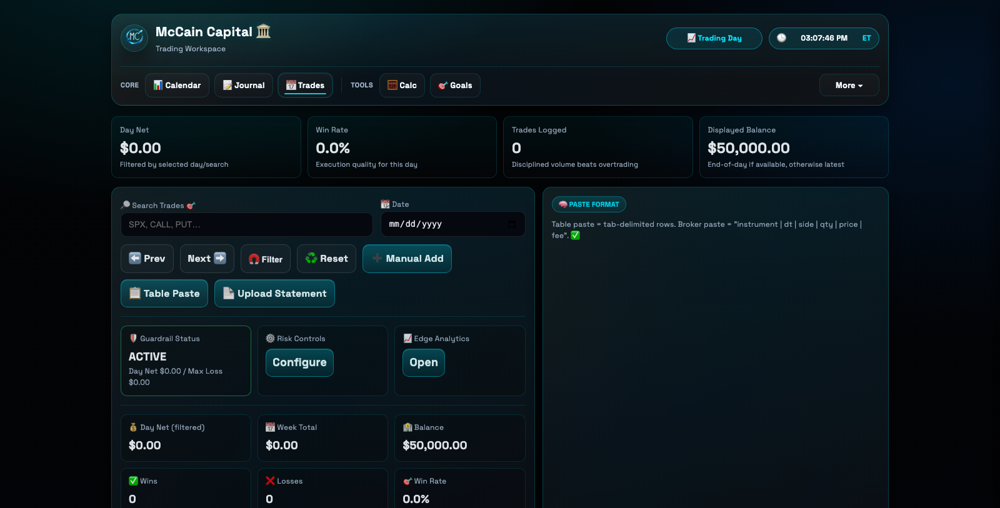

#### Journal
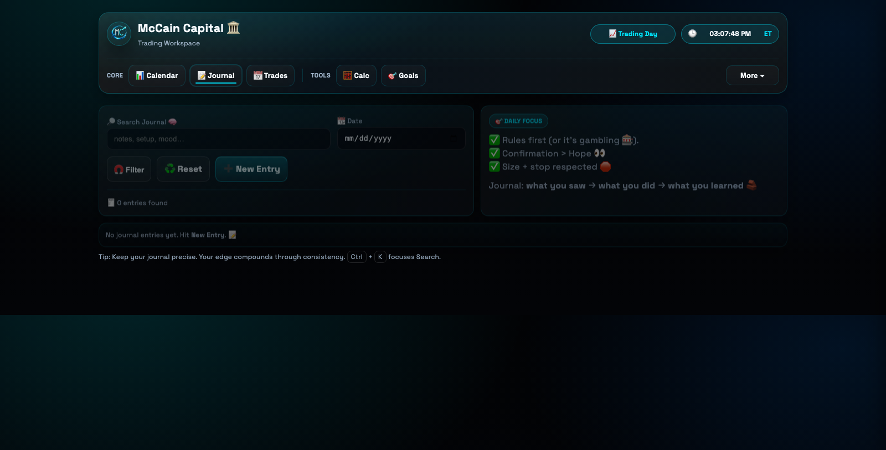

#### Analytics
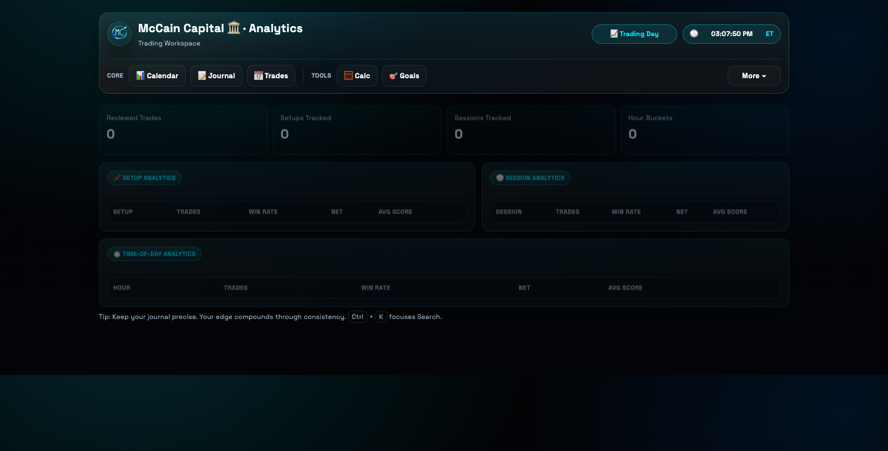

#### Calculator
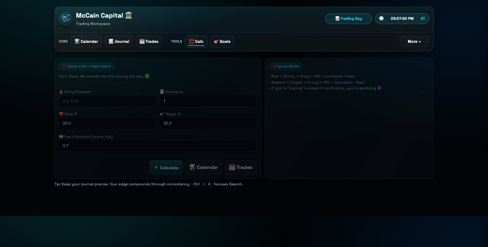

#### Payouts
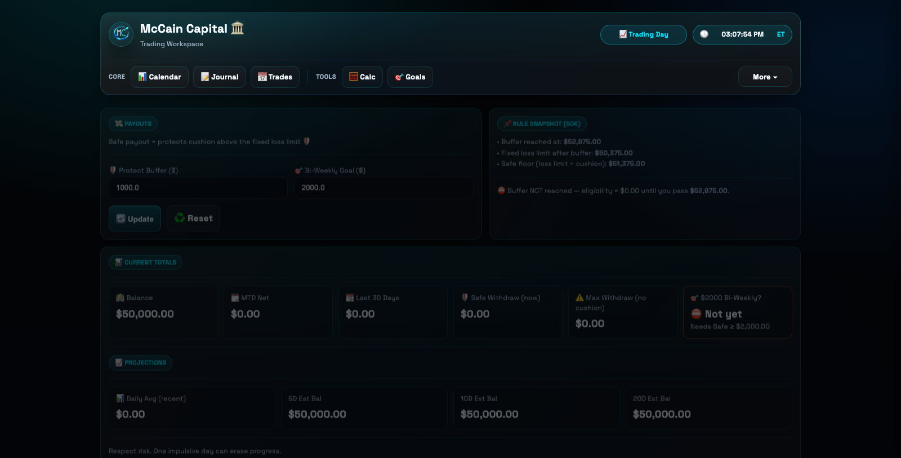

### Mobile Showcase

#### Dashboard
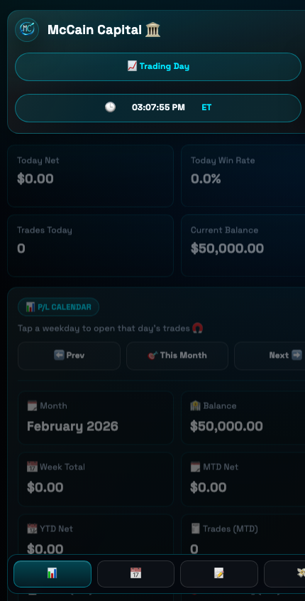

#### Trades
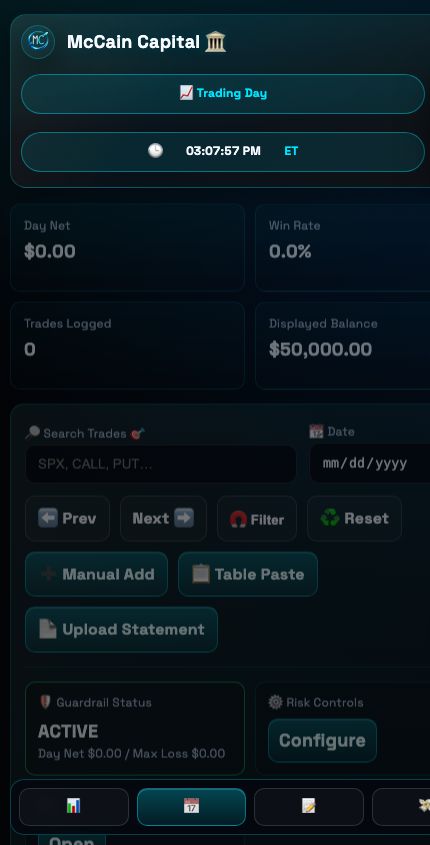

#### Journal
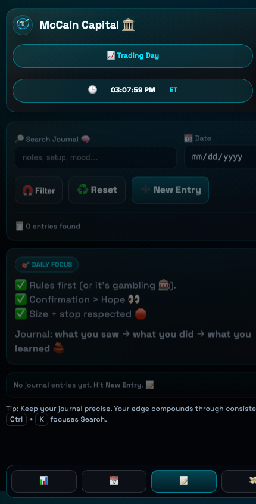

#### Analytics
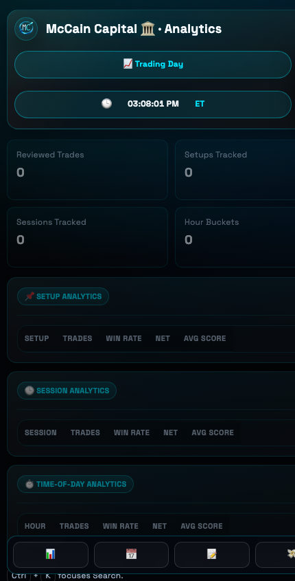

#### Calculator
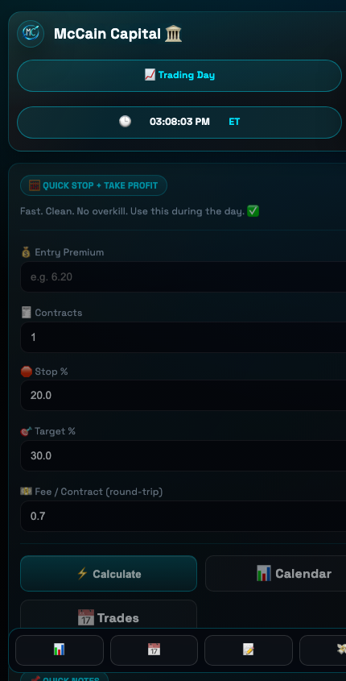

#### Payouts
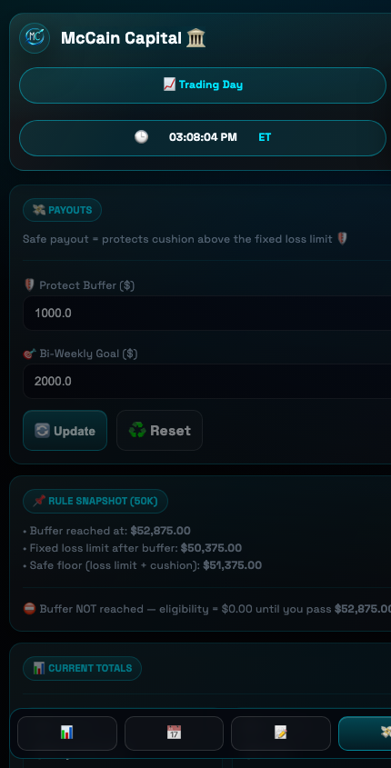

---

## Architecture At A Glance

- Study guide: `docs/ARCHITECTURE.md`
- Database architecture: `docs/DB_ARCHITECTURE.md`
- Entrypoints: `app.py`, `mccain_capital/__init__.py`, `mccain_capital/wsgi.py`
- Core module: `mccain_capital/app_core.py`
- Routing: `mccain_capital/routes/`
- Request handlers: `mccain_capital/handlers/`
- Services/business logic: `mccain_capital/services/`
- Data access: `mccain_capital/repositories/`
- Deployment stack: `Containerfile`, `services/podman-compose.tailscale.yml`

---

## Quickstart (Local)

```bash
cd /mccain-capital-repo
python -m venv .venv
source .venv/bin/activate
pip install -r requirements.txt
python -m mccain_capital.cli
```

Open: `http://localhost:5001`

Optional explicit migration run:

```bash
python migrate.py
```

## Quickstart (Podman)

```bash
cd /mccain-capital-repo
podman build -t mccain-capital-app:latest -f Containerfile .
podman rm -f mccain-capital-app 2>/dev/null || true
podman run -d --name mccain-capital-app -p 5001:5001 mccain-capital-app:latest
podman logs -f mccain-capital-app
```

Open: `http://localhost:5001`

---

## CI, Guardrails, Monitoring

- CI workflow: `.github/workflows/ci.yml`
  - lint + format checks
  - migration idempotency (`python migrate.py` twice)
  - tests
  - container smoke checks (`/healthz`, `/dashboard`, `/journal`, `/analytics`)
  - deploy guardrail gate on `push` to `main`
- Monitoring workflow: `.github/workflows/monitoring.yml`
  - scheduled health probe every 30 minutes
  - requires secret: `APP_HEALTH_URL`

---

## Repo Layout

- `mccain_capital/` application code
- `static/` CSS, icons, logo
- `docs/images/` README screenshots and branding assets
- `docs/` architecture and planning docs
- `services/` deployment manifests
- `books/` local PDFs for `/books` (not tracked)
- `uploads/` runtime import files (not tracked)
- `podman_data/` runtime container data (not tracked)

---

## Author

Built by **Kurt McCain**.
