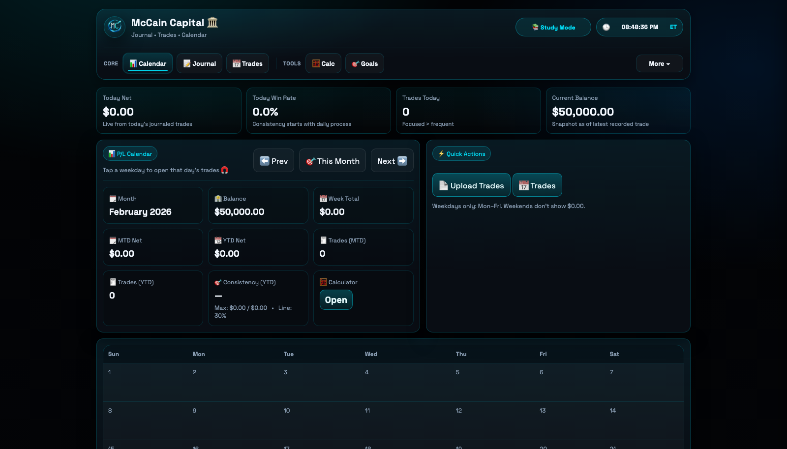
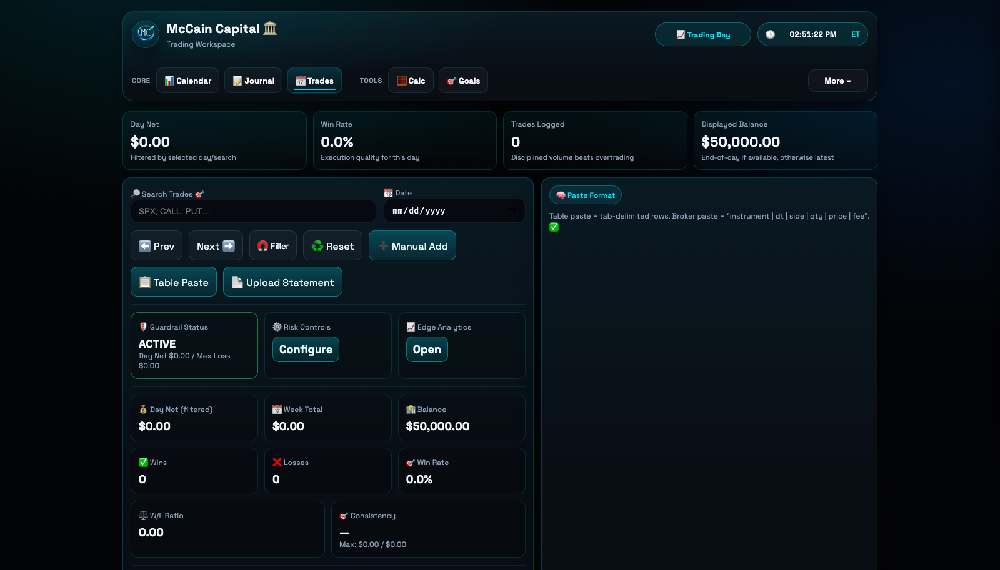
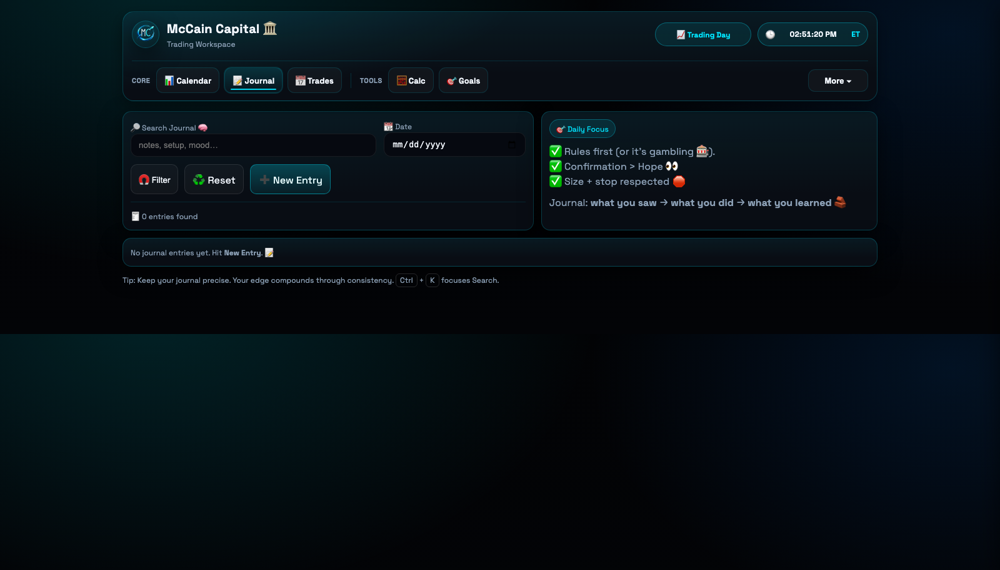
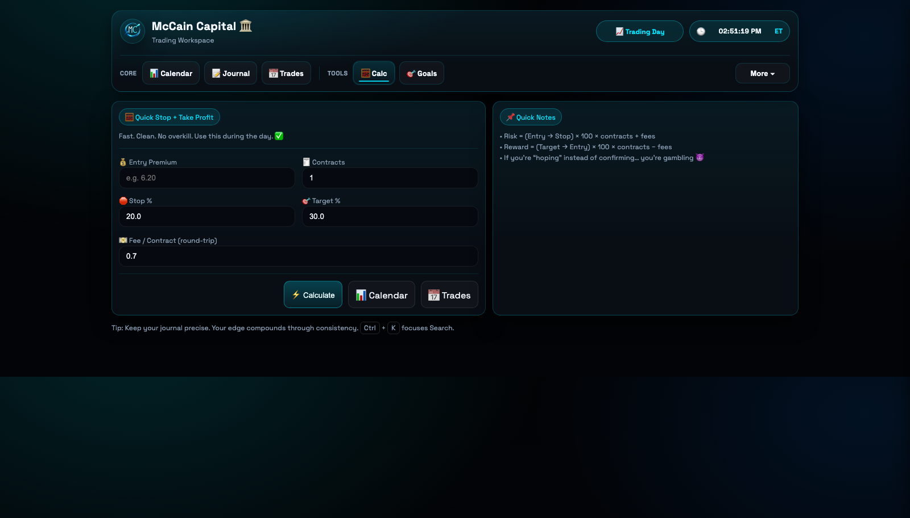
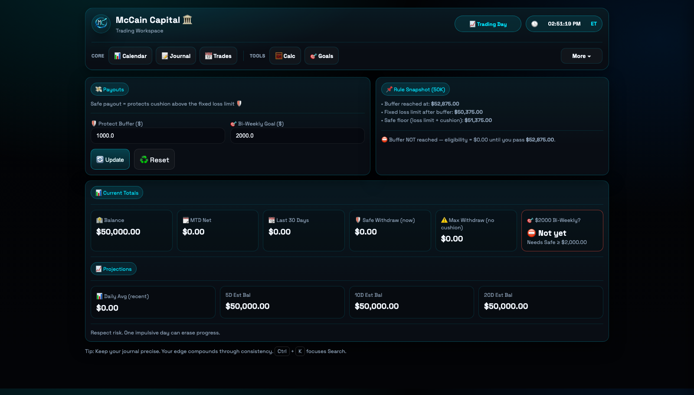
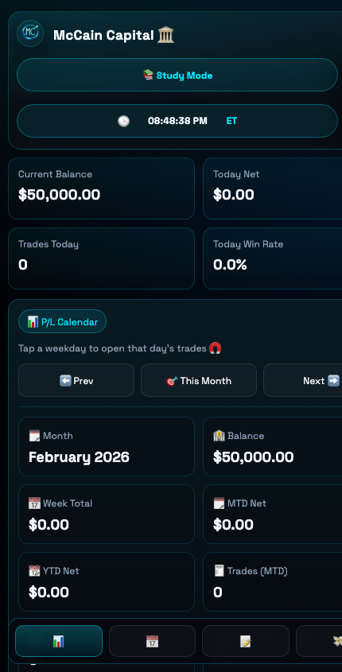
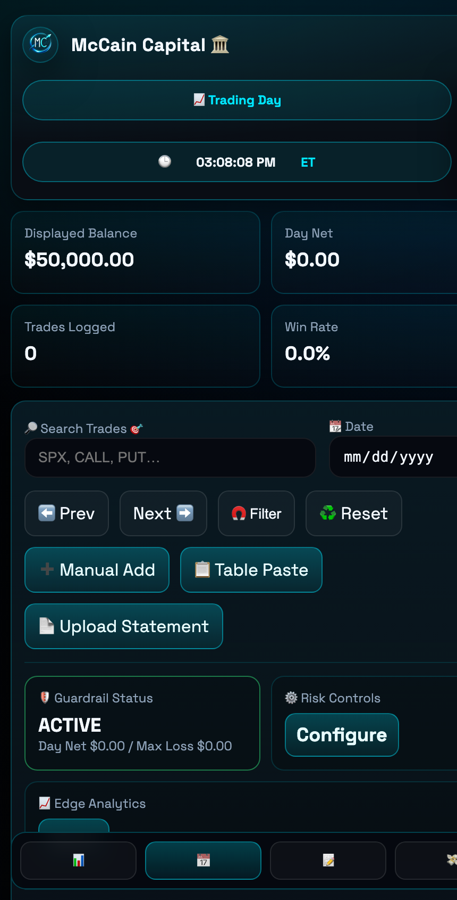
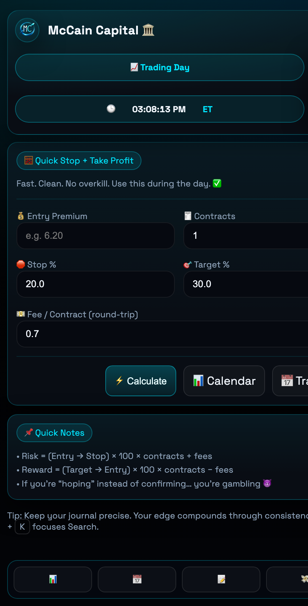
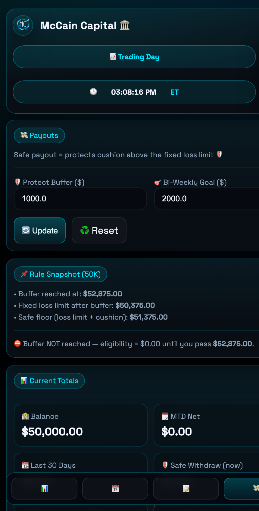

# McCain Capital 🏛️📈

<p align="center">
  
</p>

<p align="center">
  <b>A personal trading operating system</b><br/>
  Flask + SQLite app for journaling, trade review, risk controls, and consistent execution.
</p>

---

## 🚀 Highlights

- 📊 **Dashboard**: live today/MTD/YTD stats, weekday P/L heatmap, projections
- 📋 **Trades**: paste/import flows, statement upload, trade-level editing
- 📝 **Journal**: daily process logging and review discipline
- 🧮 **Calculator**: pre-trade risk/reward planning
- 🎯 **Goals + Payouts**: progress tracking and payout readiness
- 📈 **Analytics**: setup/session/hour performance breakdown
- 🔐 **Auth + Guardrails**: login + risk lockouts to enforce discipline

---

## 🖼️ Screenshots

### Desktop

#### 📊 Dashboard (Updated)


#### 📋 Trades


#### 📝 Journal


#### 🧮 Calculator


#### 💸 Payouts


### Mobile

#### 📊 Dashboard (Updated)


#### 📋 Trades


#### 📝 Journal


#### 🧮 Calculator


#### 💸 Payouts


---

## 🧱 Architecture At A Glance

- Study guide: `docs/ARCHITECTURE.md`
- Entrypoints: `app.py`, `mccain_capital/__init__.py`, `mccain_capital/wsgi.py`
- Core module: `mccain_capital/app_core.py` (legacy-compatible service surface)
- Routing: `mccain_capital/routes/`
- Request handlers: `mccain_capital/handlers/`
- Services/business logic: `mccain_capital/services/`
- Data access: `mccain_capital/repositories/`
- Deployment stack: `Containerfile`, `services/podman-compose.tailscale.yml`

---

## 🗂️ Repo Layout

- `mccain_capital/` -> application code
- `static/` -> static assets (CSS, icons, logo)
- `docs/images/` -> README screenshots + branding
- `docs/` -> architecture and planning docs
- `services/` -> deployment manifests
- `books/` -> local PDFs for `/books` (not tracked)
- `uploads/` -> runtime import files (not tracked)
- `podman_data/` -> runtime container data (not tracked)

---

## ⚡ Quickstart (Local)

```bash
cd /mccain-capital-repo
python -m venv .venv
source .venv/bin/activate
pip install -r requirements.txt
python -m mccain_capital.cli
```

Open `http://localhost:5001`

---

## 🐳 Quickstart (Podman)

```bash
cd /mccain-capital-repo
podman build -t mccain-capital-app:latest -f Containerfile .
podman rm -f mccain-capital-app 2>/dev/null || true
podman run -d --name mccain-capital-app -p 5001:5001 mccain-capital-app:latest
podman logs -f mccain-capital-app
```

Open `http://localhost:5001`

---

## 🔐 Private VPN Mode (Tailscale + Podman)

```bash
cd /mccain-capital-repo
export TS_AUTHKEY=tskey-xxxxxxxx
podman compose -f services/podman-compose.tailscale.yml up -d --build
podman compose -f services/podman-compose.tailscale.yml ps
```

---

## 🛠️ Environment Variables

- `SECRET_KEY`
- `DB_PATH`
- `UPLOAD_DIR`
- `BOOKS_DIR`
- `APP_USERNAME`
- `APP_PASSWORD` or `APP_PASSWORD_HASH`
- `SESSION_LIFETIME_MIN`
- `APP_ENV` (`dev` or `prod`)

---

## 🧭 Roadmap

- 📌 Deeper review analytics
- 🔄 Schema migrations
- 📈 Weekly auto-reports
- 🔌 Broker integrations

---

## 👤 Author

Built by **Kurt McCain** as a trading discipline platform and portfolio project.
