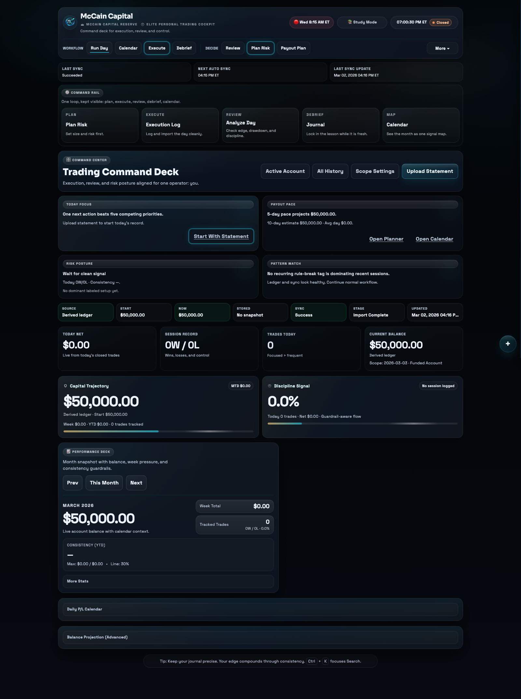
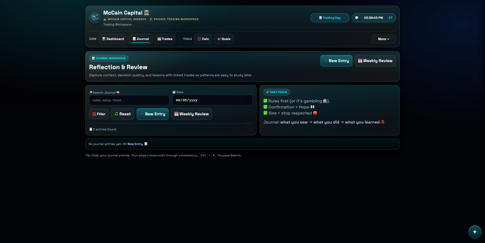
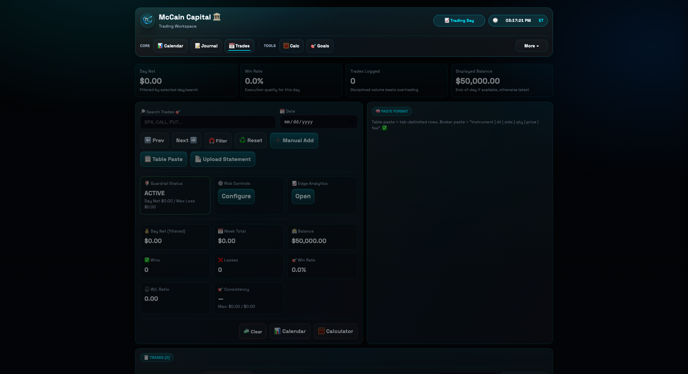
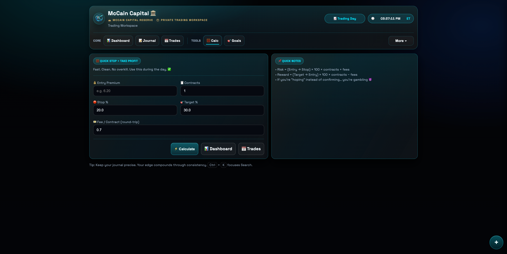
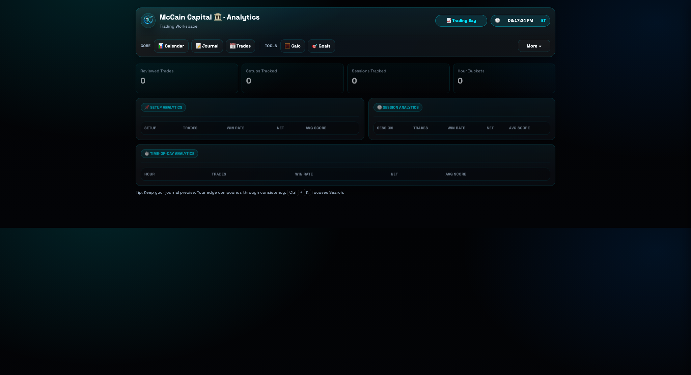
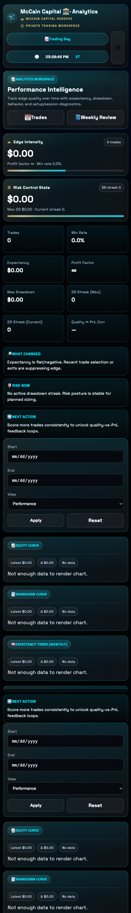

# McCain Capital 🏛️📈

  

  <b>Private Trading Workspace</b> 
  A personal trading operating system for execution, review, discipline, and growth.

---

## 🚀 Core Capabilities

- 📊 Dashboard control center with live today/MTD/YTD visibility
- 📋 Trade logging, statement upload, paste import, and reconciliation
- 📝 Journal with linked-trade workflow and weekly review
- 📈 Analytics by setup/session/hour with expectancy and drawdown diagnostics
- 🧮 Calculator for pre-trade risk/reward planning

---

## 🖼️ Screenshots

### 💻 Desktop

#### 📊 Dashboard

#### 📝 Journal

#### 📋 Trades

#### 🧮 Calculator

#### 📈 Analytics

### 📱 Mobile

#### 📊 Dashboard

#### 📋 Trades

#### 📝 Journal

#### 📈 Analytics

#### 🧮 Calculator

