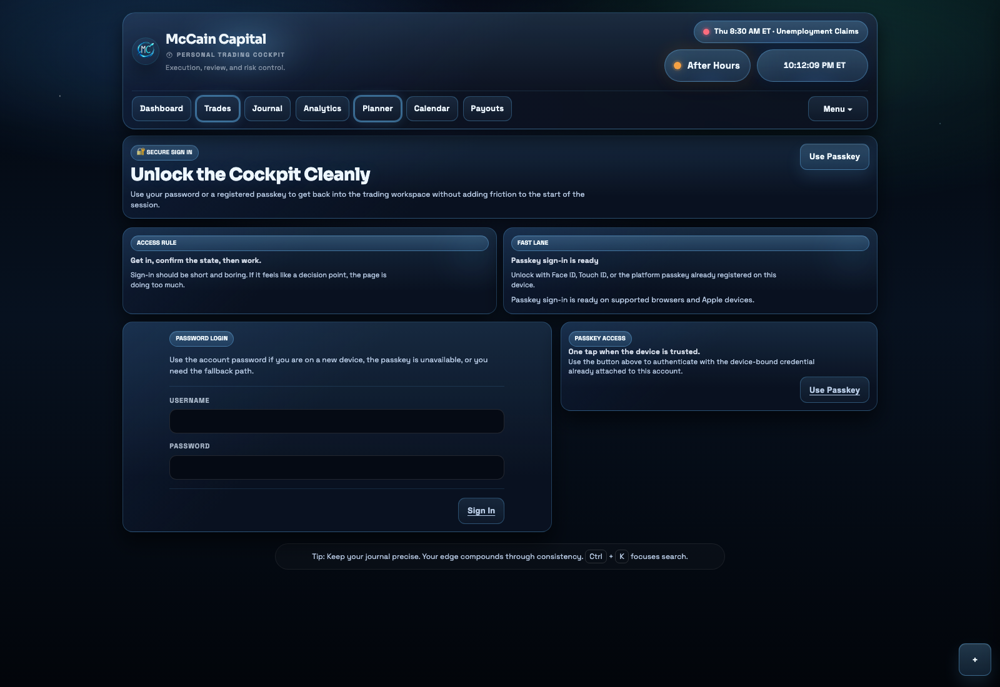
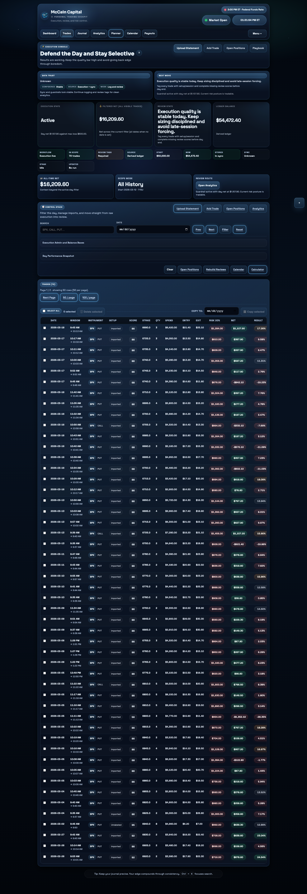
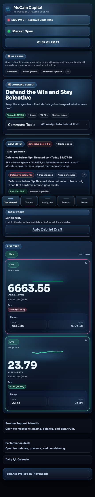
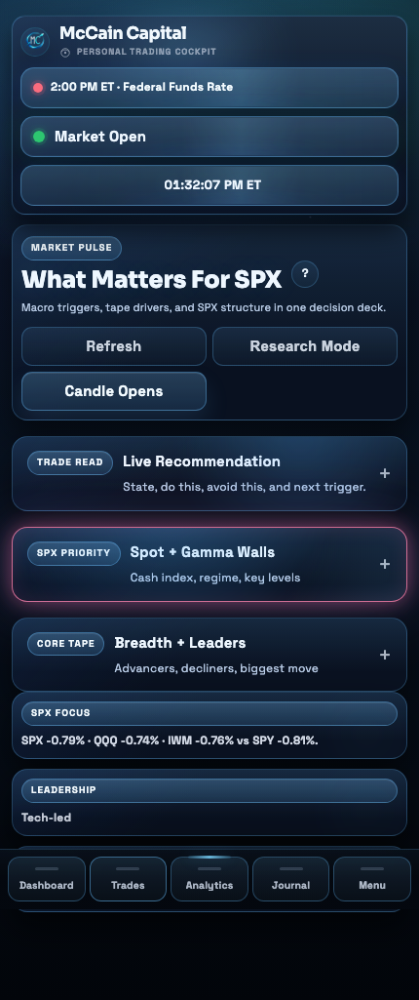
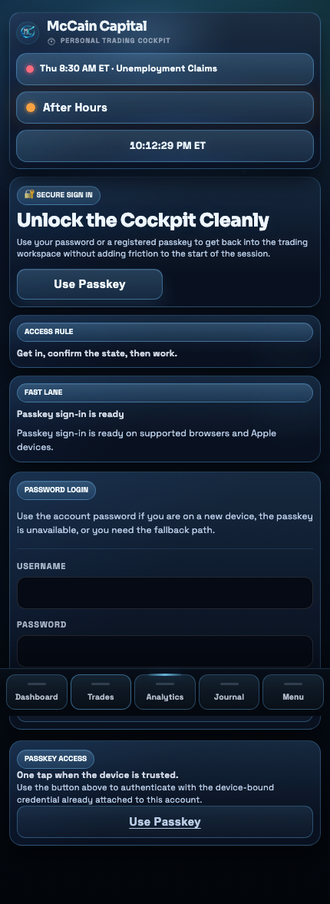

# McCain Capital 🏛️📈

<p align="center">
  
</p>

<p align="center">
  <b>Private Trading Workspace</b><br/>
  A personal trading operating system for execution, review, discipline, and performance growth.
</p>

---

## ✨ What This App Is

McCain Capital is a Flask + SQLite application that centralizes your trading workflow in one place.
It combines trade logging, journal discipline, risk controls, analytics, and planning tools into a single operating surface.
The current shell uses the McCain Capital orbital logo across the app chrome, docs, favicon, and mobile icon assets.

## 👤 Who It’s For

- Discretionary day traders and scalpers
- Traders who want structured review loops (not just raw P/L)
- Builders/learners who want a real, maintainable Python web app as a portfolio project

---

## 🚀 Core Capabilities

- 📊 **Dashboard Control Center**: live today/MTD/YTD metrics, calendar heatmap, projections
- 📋 **Trades Workspace**: manual entry, table paste, broker statement upload/import, review tags
- 📝 **Journal Workspace**: daily entries, linked-trade context, weekly review workflows
- 🧭 **Life Journal**: private personal notes, photo attachments, mood/category tags, structured summaries, and searchable recent-note feed
- 📈 **Analytics Workspace**: setup/session/hour edge diagnostics, expectancy + drawdown depth
- 🛰️ **Market Pulse**: feed-backed notification history, execution context, gamma/regime snapshots, and compact market status
- 🧮 **Calculator**: pre-trade stop/target/risk-reward planning
- 🎯 **Goals + Payouts**: discipline and payout-readiness tracking
- 🎨 **Polished App Shell**: current orbital logo, New Galaxy theme depth, compact mobile header, and viewport-safe notification bell/dropdown
- 🛡️ **Guardrails + Auth**: risk lockouts and access control support
- 🔔 **Operational Notifications**:
  - Sync success/fail
  - Guardrail lock/active state
  - Auto-sync missed/skipped warnings

### Recent UI Details

- The compact notification bell now stays aligned with the market clock on mobile and narrow tablet widths.
- The notification dropdown uses safe viewport insets and internal scrolling on phone-sized screens.
- The Life Journal page now uses a two-pane capture/feed layout on desktop and a single-column flow on compact screens.
- Life Journal entries show private-context chips, photo note support, auto-summary cards, structured "What Happened / How I Felt / Next Step" sections, and full-note expansion.
- The New Galaxy theme received a lighter compositor pass with static depth, cobalt/violet accents, and lower blur usage.

---

## 🔁 Trading Workflow (Recommended)

1. Plan risk in **Calculator**
2. Execute and log in **Trades**
3. Document context in **Journal**
4. Review behavior and edge in **Analytics**
5. Monitor consistency and targets in **Dashboard / Goals / Payouts**

---

## 🧱 Architecture At A Glance

- Entrypoints: `app.py`, `mccain_capital/wsgi.py`, `mccain_capital/__init__.py`
- Main app surface: `mccain_capital/app_core.py` (legacy-compatible core)
- Routing: `mccain_capital/routes/`
- Handlers: `mccain_capital/handlers/`
- Services (domain logic): `mccain_capital/services/`
- Repositories (data access): `mccain_capital/repositories/`
- Templates: `mccain_capital/templates/`
- Static assets: `static/`
- Docs: `docs/`

### Data Flow

Browser request → Route → Handler → Service → Repository/SQLite → Template response

### Maintainability Notes (Recent Polishing)

- Dashboard UI extracted from inline core string into `mccain_capital/templates/dashboard.html`
- Auth/Calculator screens extracted into templates:
  - `mccain_capital/templates/setup_login.html`
  - `mccain_capital/templates/login.html`
  - `mccain_capital/templates/calculator.html`
- Shared system status + alert strip centralized in:
  - `mccain_capital/services/ui.py`
  - `mccain_capital/templates/base.html`
- Life Journal capture/feed UI lives in:
  - `mccain_capital/templates/journal/life.html`
  - `mccain_capital/services/journal.py`
  - `mccain_capital/repositories/journal.py`

---

## ⚡ Quickstart (Local)

```bash
cd /mccain-capital-repo
python -m venv .venv
source .venv/bin/activate
pip install -r requirements.txt
python -m mccain_capital.cli
```

Open: `http://localhost:5001`

## 🖥️ Fitz CLI

The repo now exposes an installable `fitz` command for terminal tools.

```bash
cd /mccain-capital-repo
python -m pip install .
fitz status
fitz clean
```

`fitz clean` is a safety wrapper around Mole cleanup:

```bash
fitz clean                  # preview via mo clean --dry-run
fitz clean --apply         # execute cleanup
fitz clean --apply --debug
```

If you want isolated install semantics, use `pipx install .` instead. That gives you the same
`fitz status` command and is the cleanest base for a later Homebrew formula.

For Homebrew, publish the formula in a tap repo first, then install from the tap:

```bash
brew tap fitzcapital/tap
brew install --HEAD fitzcapital/tap/fitz
fitz status
```

The tap should live in a separate repository named `fitzcapital/homebrew-tap`.

Default local persistence now lives under `./persistent-data/`:

- DB: `persistent-data/journal.db`
- uploads/debug/artifacts: `persistent-data/uploads/`
- books: `persistent-data/books/`
- generated secret key: `persistent-data/.secret_key`

Optional explicit migration run:

```bash
python migrate.py
```

## 🐳 Quickstart (Podman)

```bash
cd /mccain-capital-repo
./scripts/run_podman_app.sh
```

Open: `http://localhost:5001`

## ☕ Caffeinate LaunchAgent

If you enabled the repo's macOS display-awake helper, it installs this LaunchAgent:

- plist: `~/Library/LaunchAgents/com.mccaincapital.caffeinate.plist`

Commands:

```bash
./scripts/install_caffeinate_launch_agent.sh   # turn on / re-enable
./scripts/disable_caffeinate_launch_agent.sh   # turn off, keep plist installed
./scripts/remove_caffeinate_launch_agent.sh    # turn off and delete plist
```

`./scripts/stop_caffeinate_for_session.sh` only unloads it for the current login session.

## Self-Control Controls

Use the repo blocker for normal control:

```bash
./scripts/self_control_status.sh          # inspect daemon/state/hosts status
./scripts/self_control_repair_state.sh    # complete expired DB sessions and rewrite clean state
sudo ./scripts/self_control_reapply.sh    # re-apply the block for the app's active session
sudo ./scripts/self_control_cancel.sh     # cancel the active session and clear the block
sudo ./scripts/self_control_restart.sh 60 # cancel active session, then start a new 60m session
```

`self_control_on.sh` starts a new manual session only when no session is active. It refuses to
replace an active session; use `self_control_restart.sh` when replacement is intentional.

The normal blocker is hosts-based. It installs/runs:

- plist: `/Library/LaunchDaemons/com.mccain.selfcontrolhosts.plist`
- state: `persistent-data/.self_control_enforcement_state.json`
- status: `persistent-data/.self_control_enforcement_status.json`

To install only the daemon without starting a block:

```bash
sudo ./scripts/install_self_control_hosts_launchd.sh
```

To remove the daemon:

```bash
sudo ./scripts/uninstall_self_control_hosts_launchd.sh
```

If the native macOS SelfControl app or PF firewall rules get stuck, use the emergency fail-safe:

```bash
sudo ./scripts/emergency_stop_self_control.sh
```

This unloads and removes the repo's Self-Control launch daemons, removes the macOS SelfControl
privileged helper and PF anchor if present, clears hosts/PF network blocks, marks active
Self-Control sessions as cancelled, and writes inactive enforcement state so the app does not
immediately re-arm the block.

### Data Persistence

The recommended container flow bind-mounts the repo's real `persistent-data/` into `/data`,
so the container uses the same journal DB, uploads, books, and generated secret key as local runs.

- host DB: `persistent-data/journal.db`
- host uploads/debug artifacts: `persistent-data/uploads/`
- host books/library files: `persistent-data/books/`
- host secret key: `persistent-data/.secret_key`

Equivalent manual run:

```bash
cd /mccain-capital-repo
podman build -t localhost/mccain-capital-app:latest -f Containerfile .
podman rm -f mccain-capital-app 2>/dev/null || true
podman run -d --name mccain-capital-app -p 5001:5001 \
  -v "$(pwd)/persistent-data:/data" \
  localhost/mccain-capital-app:latest
podman logs -f mccain-capital-app
```

In-container paths:

- journal/trades database: `/data/journal.db`
- uploads/debug artifacts: `/data/uploads`
- books/library files: `/data/books`
- generated secret key: `/data/.secret_key`

### Tailscale

If this Mac is on Tailscale and Podman publishes `5001`, the app is reachable on the machine's
Tailscale IP as well:

```bash
tailscale ip -4
curl -sf http://YOUR_TAILSCALE_IP:5001/healthz
```

The included sidecar config at `services/podman-compose.tailscale.yml` now mounts `../persistent-data`
into the app container so the Tailscale-served container also uses the real chart/app data.

## 🚆 Railway Deployment

Railway is configured to build directly from the repo `Dockerfile` and probe the app on `/healthz`.

- Build config: `railway.json`
- Railway compatibility entrypoint: `main.py`
- Container runtime: `Dockerfile`
- App bind target: `0.0.0.0:${PORT}`

Recommended Railway setup:

```bash
APP_ENV=prod
SECRET_KEY=your-long-random-secret
APP_USERNAME=your-login
APP_PASSWORD=your-password
PORT=5001
PERSISTENT_DATA_DIR=/data
DB_PATH=/data/journal.db
UPLOAD_DIR=/data/uploads
BOOKS_DIR=/data/books
SECRET_KEY_FILE=/data/.secret_key
```

Recommended deployment notes:

- Attach a Railway volume mounted at `/data` so journal data, uploads, artifacts, books, and the generated secret key survive restarts.
- Keep the Railway health check pointed at `/healthz`.
- `main.py` exists so Railway environments that assume `gunicorn main:app` still boot the packaged Flask app correctly.
- If you use a public Railway domain, make sure auth is enabled with `APP_ENV=prod` and a real `SECRET_KEY`.

## 🖼️ Screenshots
Refreshed from the live authenticated app on **March 18, 2026** with **Midnight Galaxy** as the default theme.

Capture command:
```bash
.venv/bin/python scripts/capture_portfolio_screenshots.py
```

### 💻 Desktop Views
| Dashboard | Market Pulse |
|---|---|
|  |  |

| Trades | Analytics |
|---|---|
|  |  |

### 📱 Mobile Views
| Dashboard | Market Pulse |
|---|---|
|  |  |

| Trades | Analytics |
|---|---|
|  |  |

---

## 🔁 CI / Quality Guardrails

- Workflow: `.github/workflows/ci.yml`
- Includes:
  - Ruff lint checks
  - Black formatting checks
  - Pytest suite
  - Migration idempotency run
  - Container smoke checks (`/healthz`, `/dashboard`, `/journal`, `/analytics`)
  - Visual smoke guardrail (desktop + mobile screenshots, uploaded as CI artifacts)

## 📡 Monitoring

- Workflow: `.github/workflows/monitoring.yml`
- Scheduled health probe (requires `APP_HEALTH_URL` secret)

---

## 👤 Author

Built by **Kurt McCain** as a trading discipline platform and engineering portfolio project.
