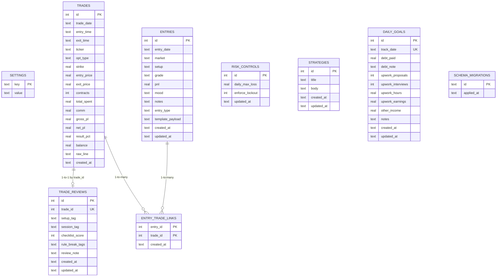

# McCain Capital Database Architecture

This document explains how the SQLite database is structured, how tables relate, and how data moves through the app.

## 1) Database Basics

- Engine: SQLite
- Default file: `journal.db`
- Migration source: `mccain_capital/migrations/__init__.py`
- Migration history table: `schema_migrations`

Current migration versions:
- `0001_baseline`
- `0002_journal_phase2`

## 2) ER Diagram



## 3) Table-by-Table Purpose

- `settings`
  - Global key/value config (app-level tunables).

- `trades`
  - Canonical ledger for imported/manual trades.
  - Analytics and dashboard P/L metrics read from here.

- `trade_reviews`
  - Review metadata attached to a trade (`trade_id` is unique).
  - Powers setup/session analytics and rule-break summaries.

- `entries`
  - Journal entries (pre-market plan, debrief, post-market review).
  - Holds free-text notes and structured metadata.

- `entry_trade_links`
  - Bridge table for many-to-many linking:
  - One journal entry can reference many trades.
  - One trade can be referenced by multiple entries.

- `risk_controls`
  - Singleton policy row used by lockout guardrail logic.

- `strategies`
  - Strategy/playbook records.

- `daily_goals`
  - Daily goals/progress tracking.

- `schema_migrations`
  - Internal migration bookkeeping table.

## 4) High-Level Data Flows

1. Statement import flow
- Raw statement/broker lines are parsed into fills.
- Fills are paired into completed round-trip trades.
- Trades are inserted into `trades`.
- Auto-review metadata is inserted into `trade_reviews`.
- Duplicate protection prevents reinserting identical imports.

2. Journal flow
- User creates/edits row in `entries`.
- Linked trades are persisted to `entry_trade_links`.
- Weekly review joins `entries` + `entry_trade_links` + `trade_reviews`.

3. Analytics flow
- Reads primarily from `trades` + `trade_reviews`.
- Aggregates by setup/session/hour and computes expectancy, drawdown, correlation, trends.

4. Risk-control flow
- Reads `risk_controls` + day totals from `trades`.
- Determines whether day lockout should block new trade imports/entries.

## 5) Why Migrations Matter Here

Before migrations, schema drift was handled in runtime code (`CREATE/ALTER` checks in multiple places).  
Now schema evolution is centralized and versioned:
- deterministic startup behavior
- safer deploys
- clear upgrade path for future schema changes

## 6) Useful Dev Commands

Run migrations manually:

```bash
python migrate.py
```

Check applied migration versions:

```bash
sqlite3 journal.db "SELECT id, applied_at FROM schema_migrations ORDER BY id;"
```

Quick table list:

```bash
sqlite3 journal.db ".tables"
```

